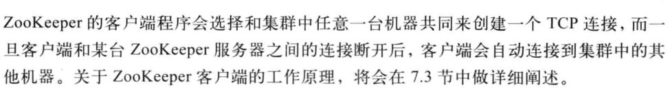
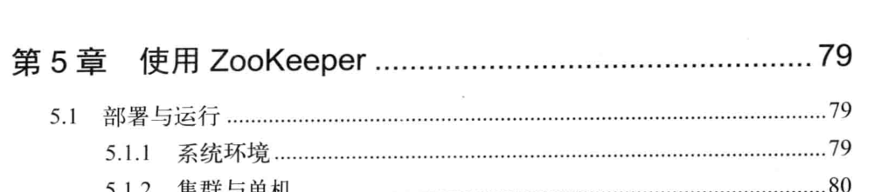
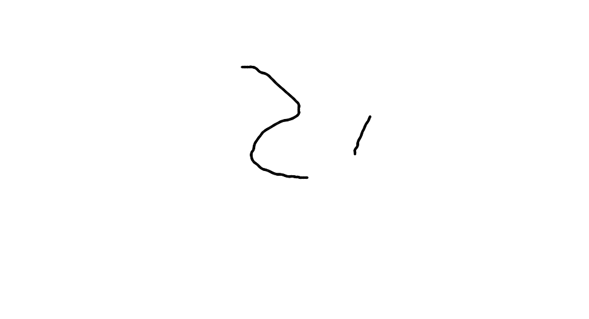

# 从PAXOS到ZOOKEEPER分布式一致性原理与实践
* ###### ZooKeeper中客户端来判断连接集群中的哪个实例
  >  [P71](bookxnotepro://opennote/?nb={9e6e5d5f-1dab-461f-8da6-d69631882a90}&book=94396131b2ff2fefbdd13dd88bbf04c9&page=71&x=253&y=409&id=4&uuid=58543932324504425160965b0b2d36c2)
* ###### VS的
  >  [P7](bookxnotepro://opennote/?nb={9e6e5d5f-1dab-461f-8da6-d69631882a90}&book=94396131b2ff2fefbdd13dd88bbf04c9&page=7&x=258&y=77&id=5&uuid=3b32477e2cc892e319de8da4ee19a746)
  撒旦法师打发
  四大法师
  阿道夫sdsadf
  
  ------
  
  
  
  ------
  
  sdafasdf sfasdf
  
  ------
  
